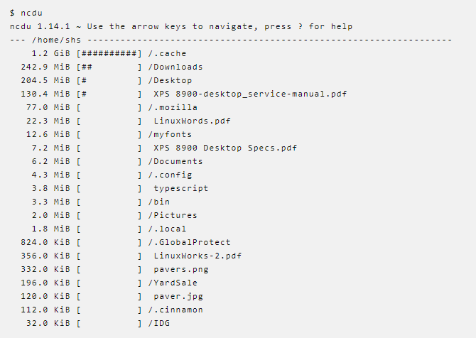

# Travail planifié, semaine #35

- Se dire bonjour / Faire connaissance (si nécessaire)
- Voir les [objectifs du module](https://www.modulbaukasten.ch/module/323/1/fr-FR?title=Programmer-de-mani%C3%A8re-fonctionnelle)
- Voir le [chemin](https://roadmap.sh/r/embed?id=66b88565b64402e0526d8ebc) vers ces objectifs
- Voir [les modalités d'évaluation](../evaluation/DEP.md)

## Mode opératoire
- [Git workflow](../USEME.md)

## Paradigmes
- [Théorie générale](../supports/source/01-paradigmes.md)
- [Théorie spécifique](../supports/source/02a-fonctions-sup.md) au paradigme fonctionnel
  
## Pratique

Remarque: LinQ existe sous deux formes (syntaxes) différentes: **query syntax** et **method syntax**. Nous n'aborderons que la method syntax dans ce module, car elle est plus moderne, complète, et qu'elle est proche d'autres langages (principalement javascript).

### Exercice place du marché
- Exercice [Place du marché](../exos/marché) pour:
  - Se remettre le C# dans la tête
  - Se remettre les outils dans les doigts (Visual Studio, Git)
  - Découvrir LinQ
  - (re)voir de bonnes pratiques de développeur

### Exercice NCDU

#### Version 1
  - En s’inspirant de la [doc suivante](https://www.geeksforgeeks.org/c-sharp/c-sharp-program-to-estimate-the-size-of-folder/) et sans utiliser LINQ,
  
  - Créer un programme similaire à [ncdu](https://dev.yorhel.nl/ncdu) pour afficher des statistiques sur l’utilisation d’un répertoire/disque sur windows
  
  - Attention à afficher les informations de taille de manière intelligente (kb,mb,gb,...)
  - Faire un commit

#### Version 2
  - En s’inspirant de la [doc suivante](https://learn.microsoft.com/en-us/dotnet/csharp/linq/how-to-query-files-and-directories),
  - Adapter le programme précédent afin de le rendre plus concis
  - Faire un commit
